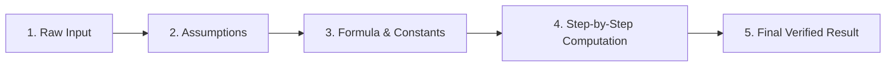

<div align="center">


# CalcForge
### *The Precision, Transparent, Local-First Calculator & 2D Graphing Studio*

[](https://www.oracle.com/java/)
[](https://spring.io/projects/spring-boot)
[](https://www.mysql.com/)
[](https://getbootstrap.com/)
[](https://developer.mozilla.org/en-US/docs/Web/JavaScript/Guide/Modules)
[](LICENSE)

<p align="center">
  <a href="#-key-features">Key Features</a> •
  <a href="#-quick-start">Quick Start</a> •
  <a href="#-architecture">Architecture</a> •
  <a href="#-the-calculation-trail">Calculation Trail</a> •
  <a href="#-configuration">Configuration</a> •
  <a href="#-api-documentation">Documentation</a>
</p>

---

</div>

## 🌟 Overview

**CalcForge** is a local-first, all-in-one calculation platform that replaces opaque calculator apps with complete mathematical transparency. Every operation yields an auditable **Input → Assumptions → Formula → Computation → Result** trail. 

Built with **zero external internet dependencies for core operations**, CalcForge offers arbitrary-precision decimal arithmetic, first-class workspace variables, what-if scenario modelling, 2D coordinate function graphing, offline unit conversion, and searchable history. Optional cloud sync, AI assistance, and shared workspaces can be enabled whenever needed.

---

## ✨ Key Features

| Feature | Description |
| :--- | :--- |
| 🔍 **5-Stage Calculation Trail** | Auditable breakdown showing assumptions, formula expansion, evaluation steps, and precision boundaries. |
| ⚡ **100% Offline-First Engine** | All primary arithmetic, graphing, unit conversion, variables, and formulas run without an active internet connection. |
| 📐 **Variables & Formulas** | First-class workspace variables and reusable parameterized formulas with case-insensitive name resolution. |
| 📈 **2D Coordinate Graphing** | Auto-scaled 2D graphing studio with coordinate grids, axes, numerical tick marks, auto-plotting, and interactive hover crosshairs. |
| 📋 **Workspace Canvas** | Multi-card reactive canvas to save, organize, compute, and compare scenario analyses. |
| 🎨 **Adaptive Modern UI** | Seamless Light and Dark theme modes with high-contrast scientific styling and responsive layouts. |
| 🛡️ **Dual-Engine Architecture** | Precision Spring Boot Java engine paired with a client-side JavaScript fallback engine when the server is unreachable. |

---

## 🏗️ Architecture & Project Structure

CalcForge follows a modular structure with zero build steps required on the frontend:

```text
calcforge/
├── 🚀 run.bat              # One-click Windows runner (handles environment, backend & frontend)
├── 📂 backend/             # Spring Boot 3.3 (Java 17) REST API
│   ├── src/main/java/com/calcforge/
│   │   ├── engine/         # Lexer, recursive-descent Parser, AST & Evaluator
│   │   ├── domain/         # JPA Entities (Calculations, Workspaces, Scenarios, Units)
│   │   ├── controller/     # Local & Cloud REST Controllers
│   │   └── service/        # Calculation, Graph, Unit, Sync & Security services
│   └── src/main/resources/ # Flyway migrations, seed demo data & application profiles
├── 📂 frontend/            # HTML5 + Vanilla JS (ES Modules) + Bootstrap 5
│   ├── css/                # Custom design system with light/dark theme variables
│   ├── js/
│   │   ├── engine/         # Client-side fallback calculation & sampling engine
│   │   ├── views/          # Calculator, Canvas, Variables, Graph, History & Settings
│   │   └── api.js          # REST client communicating with local/cloud endpoints
│   └── vendor/             # Vendored Bootstrap 5 (zero CDN dependencies)
└── 📂 docs/                # Comprehensive architectural and API documentation
    ├── API_CONTRACTS.md     # Complete REST endpoint specifications
    └── CALCULATION_TRAIL.md # Five-stage trail model and precision specification
```

---

## 🚀 Quick Start

### Option A: One-Click Quick Run (Windows)

CalcForge includes an automated launcher script [`run.bat`](run.bat) at the project root that verifies your environment, configures the database, packages/starts the backend, and serves the frontend:

```bat
run.bat
```

1. Checks for **Java 21/17+**, **MySQL**, **Python/Node.js**, and bundled **Maven**.
2. Starts the frontend static server on `http://localhost:5500`.
3. Boots the Spring Boot backend on `http://localhost:8080`.
4. Automatically opens your default web browser to the application.

---

### Option B: Manual Setup

#### Prerequisites
- **JDK 17+**
- **Maven 3.9+**
- **MySQL 8.x** (running locally on port `3306`)
- **Python 3** or **Node.js** (for static frontend serving)

#### 1. Database Configuration
Create the database and user (Flyway will automatically execute migrations and seed initial unit and demo data on boot):

```sql
CREATE DATABASE calcforge CHARACTER SET utf8mb4;
CREATE USER 'calcforge'@'localhost' IDENTIFIED BY 'calcforge';
GRANT ALL PRIVILEGES ON calcforge.* TO 'calcforge'@'localhost';
```

#### 2. Start the Backend
```bash
cd backend
mvn spring-boot:run
```
*The backend starts with the `local` profile on `http://localhost:8080`.*

To run backend unit tests:
```bash
mvn test
```

#### 3. Start the Frontend
From the `frontend/` directory, launch any local static server:

```bash
cd frontend
# Using Python:
python -m http.server 5500

# Or using Node.js:
npx serve -l 5500
```

Open `http://localhost:5500` in your web browser.

---

## 🔍 The Calculation Trail

Unlike generic calculators that only return a raw number, CalcForge guarantees mathematical transparency by returning a structured 5-stage calculation trail:



1. **Input**: Verifies and echoes the clean mathematical expression.
2. **Assumptions**: Captures evaluation context (e.g. `AngleMode = DEGREES`, `Precision = 20 sig figs`).
3. **Formula**: Documents standard equations and explicit substitutions.
4. **Computation**: Outlines intermediate reduction steps.
5. **Result**: Delivers exact decimal outputs alongside human-readable scientific formats.

---

## ⚙️ Configuration & Environment

Configuration is managed via Spring Boot profiles and environment variables:

| Environment Variable | Default Value | Purpose |
| :--- | :--- | :--- |
| `SPRING_PROFILES_ACTIVE` | `local` | Active profile (`local` = 100% offline, `cloud` = accounts & sync) |
| `DB_HOST` | `localhost` | MySQL Host |
| `DB_PORT` | `3306` | MySQL Port |
| `DB_NAME` | `calcforge` | Database Name |
| `DB_USERNAME` | `calcforge` | Database User |
| `DB_PASSWORD` | `calcforge` | Database Password |
| `CALCFORGE_JWT_SECRET` | *None* | JWT Secret key (required for `cloud` profile) |
| `AI_ASSIST_ENABLED` | `false` | Enable Anthropic Claude AI calculation assist |
| `ANTHROPIC_API_KEY` | *None* | API Key for Claude AI assistant |
| `SHARED_WORKSPACES_ENABLED` | `false` | Enable multi-user workspace collaboration |

---

## 📚 Documentation

For in-depth specifications, refer to the documentation directory:
- 📖 [**Calculation Trail & Precision Model**](docs/CALCULATION_TRAIL.md): Details on arbitrary-precision exact decimal boundaries vs. transcendental floating-point limits.
- 📡 [**REST API Contracts**](docs/API_CONTRACTS.md): Comprehensive request and response schemas for all local and cloud endpoints.

---

## ⚖️ License

CalcForge is open-source software licensed under the [MIT License](LICENSE).
